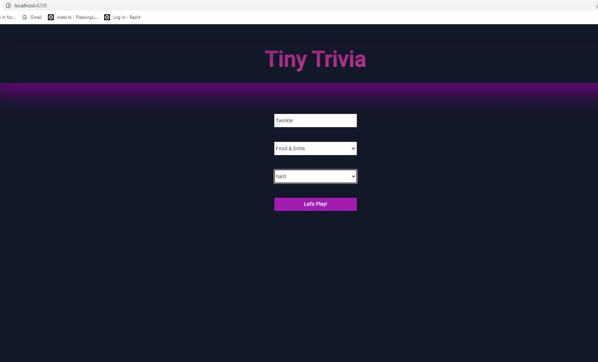
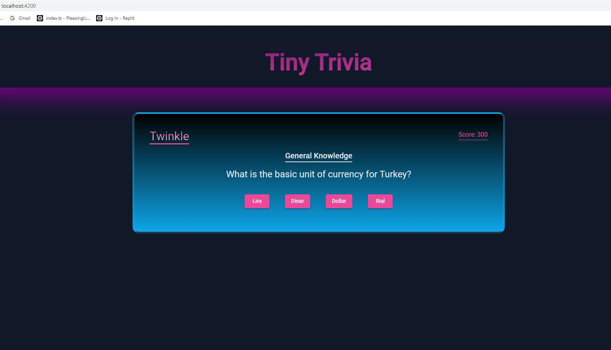
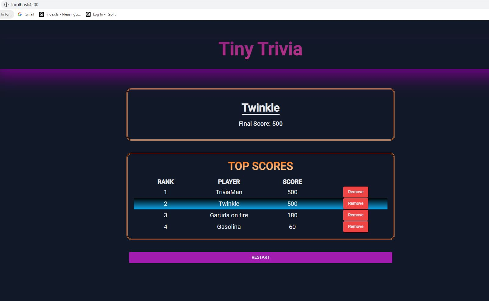
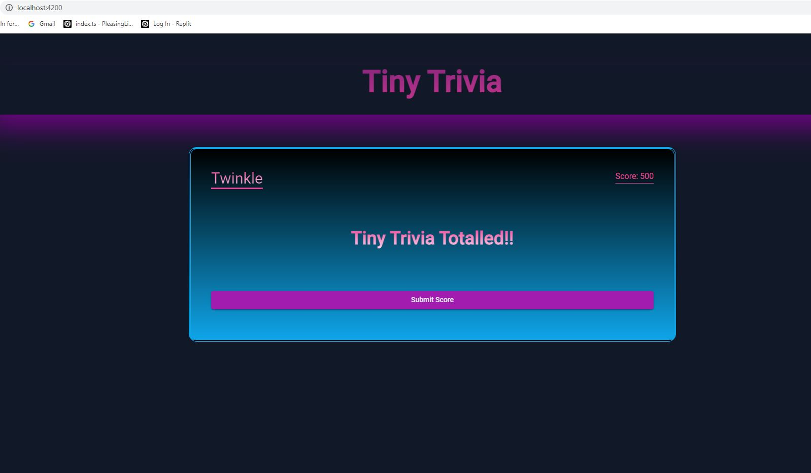

# TriviaApp
```
This project was generated with [Angular CLI](https://github.com/angular/angular-cli) version 14.1.3.  and  restdb.io as a serverside API.
```

## Development server
```
Run `ng serve --open` at the command prompt for a dev server. Navigate to `http://localhost:4200/`. The application will automatically reload if you change any of the source files.
```

## The requirement of the Project was as below : 
```
TRIVIA API

Task: Create a trivia app where the user answers multiple-choice questions. Scores are stored in a database powered by a REST API.

API: https://the-trivia-api.com/

Build Specifications
Allow the user to choose difficulty level and category (or categories) from a form.
Use a limit of 5 to fetch five matching questions from the API.
Display the resulting questions from the API one-by-one. For each question:
Display the question text.
Display the question category.
Display all of the correct and incorrect answers as buttons in random order.
Keep track of the user's score. If they get it right add one.
After answering all the total score is displayed. The user can enter their name for the high scores table. Save their high score and name with a POST to restdb.io. Redirect them to the high-scores route.
The high-scores route shows a list of all players ranked from highest to lowest score.
Each high score has a delete button which will remove it from the database and the high scores list.
(Optional) Deploy your final version with surge.sh or another hosting provider. Don't forget to handle URL rewrites for the routes.
```


## API used :
```
*  triviaURL: 'https://the-trivia-api.com/api/',
*  databaseURL: 'https://trivia-8125.restdb.io/rest/highscores',
```

## Server-side db used : 
```
*  restdb.io
```

## The output is seen as below :

#### Homepage

#### Question Page

#### Scores Page

#### Submit Page


## Github Link :
```
https://github.com/miraj00/Trivia-App
```

## contributors :

```
Created by : Tito Sanchez, Miraj Patel, Araya G Araya, Divya Palaparthy, Pavan Kumar, Sam Rashed
```